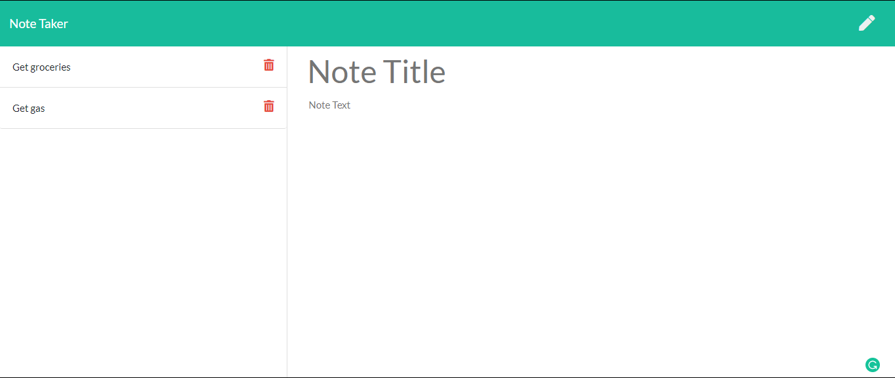

# Note-Taker



### Description
```
The note taker uses html routes to display the HTML, then uses Javascrip ajax Calls alongside serverside api routes to Save and delete notes the user creates.
```

#### Installation

* npm i express path fs uuid 